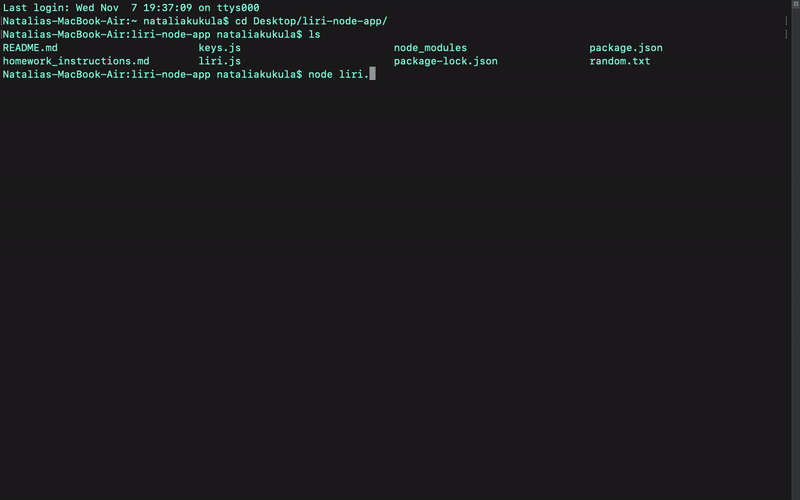
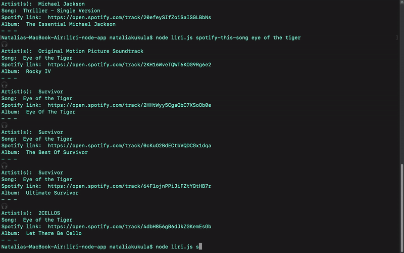
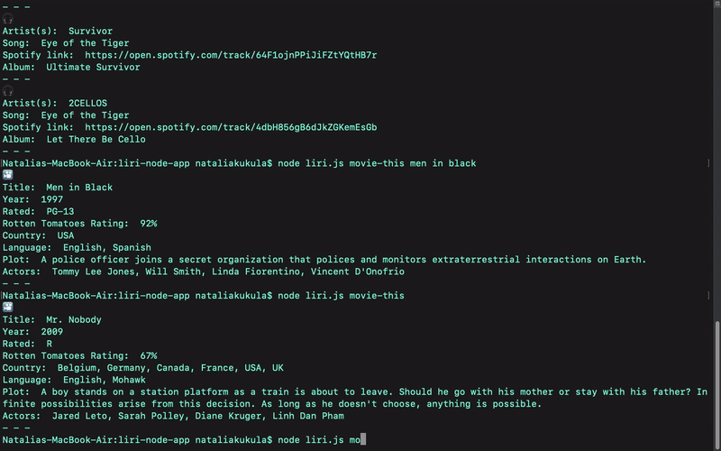
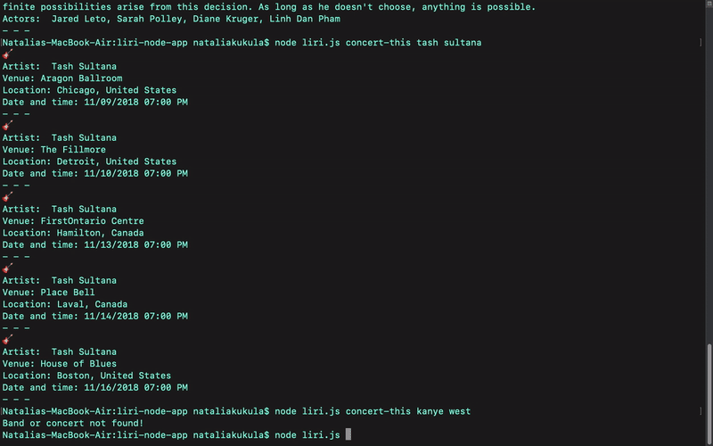

# Liri Bot
**Name:** Liri-Node-App \
**Created for:** Northwestern Coding Bootcamp \
**Developer:** Natalia Kukula \
**Deployment Date:**  November 7, 2018 \
**Runtime:** Node.js\
**Command Line:** Git Bash\
**Built with:** Javascript, Node File System\
**API:** (OMBD, Bands In Town, Spotify)\
**NPM:** (dotenv, request, moment.js, node-spotify-api)

## Summary
Liri is a CLI application that sends requests to OMDB, Bands in Town and Spotify APIs in the node.js environment.

Liri is a language interpretation and recognition interface that takes in parameters (*commands*) and gives back a data response.

| Command | Description |
| --- | --- |
| `node liri.js spotify-this-song (song name)` | Liri searches Spotify API for songs |
| `node liri.js movie-this (movie title)` | Liri searches OMDB API for movies |
| `node liri.js concert-this (band/artist name)` | Liri searches Bands in Town API for concerts |
| `node liri.js do-what-it-says` | Liri reads a file to perform a search based on the string in it |

The full [demo](https://www.youtube.com/watch?v=kt36t4lYzfo&t=2s) is available on Youtube.

### **1. spotify-this-songs:**

* command pulls a limit of 5 items from the Spotify API (artist, song, link, album)
* npm package "node-spotify-api" utilized to make the call
* if no song is provided in command, liri pulls up a search of "The Sign" by Ace of Base 

### **2. movie-this:**

* command pulls a movie from the OMDB API (title, year, imdb rating, rotten tomatoes rating, country, language, plot, actors)
* npm package "request" utilized to make the call
* if no title is provided in command, liri pulls up a search of "Mr. Nobody"

### **3. concert-this:**

* command pulls a limit of 5 events from the Bands In Town API (artist, venue, date)
* npm package "request" utilized to make the call
* if there are no concerts available, liri says "No concerts..."

### **4. do-what-it-says:**

* command pulls a string from random.txt file and runs it as one of the 3 previous commands
* node file system function "fs.readFile()" used to access the data
* current text "hard coded" in file: *spotify-this-song,"I Want it That Way"*

## Notes:
My first backend app.